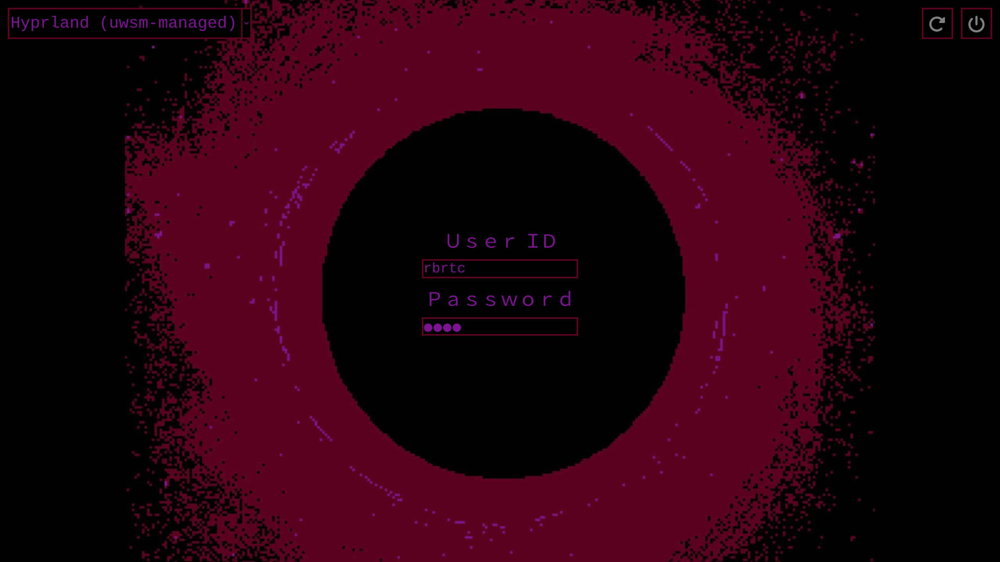

# sddm-milk-theme

An SDDM theme inspired by the game
[Milk Inside a Bag of Milk Inside a Bag of Milk](https://store.steampowered.com/app/1392820/Milk_inside_a_bag_of_milk_inside_a_bag_of_milk/)
by Nikita Kryukov.<br>

**Note:
This is a fork of the Lain Wired theme by
[lll2yu](https://github.com/lll2yu/sddm-lain-wired-theme) which is a fork of
[mixedCase's](https://gitlab.com/mixedCase/sddm-lain-wired-theme) version.**<br>

I just used the fork as a base for my own theme. It is not similar to the forked version.<br>



# Changes from the fork
- Renamed theme to `milk`
- Ported qml to Qt 6
- Changed background image
- Changed color and widget styles
- Removed audio and gif files
- Removed tooltips
- Added custom shutdown and reboot buttons

# Installation

Liberation Mono is used as the font, so make sure you have that installed on the
distro you are using.

Arch:

```bash
sudo pacman -S ttf-liberation --needed
```

Theme installation:

```bash
git clone https://github.com/rbrtc/sddm-milk-theme
sudo cp -r sddm-milk-theme /usr/share/sddm/themes
```

# Usage

Edit your sddm config in `/etc/sddm.conf.d/` and set `sddm-milk-theme`
as the current theme.<br>

```shell
# /etc/sddm.conf.d/myconfig.conf, for example

[Theme]
# Current theme name
Current=sddm-milk-theme
```

View https://wiki.archlinux.org/title/SDDM for more info about SDDM configuration.
